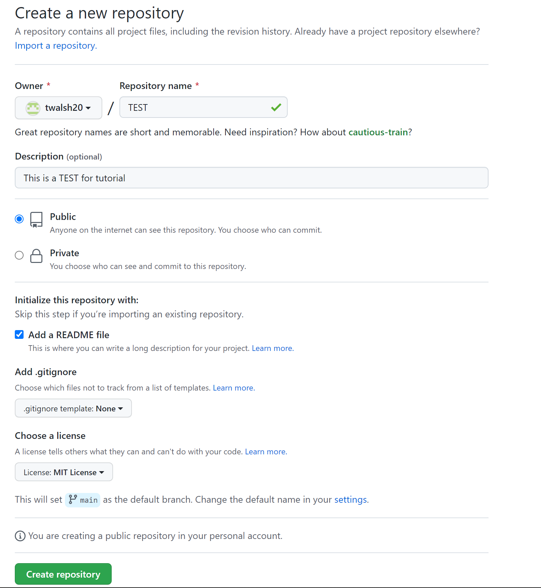
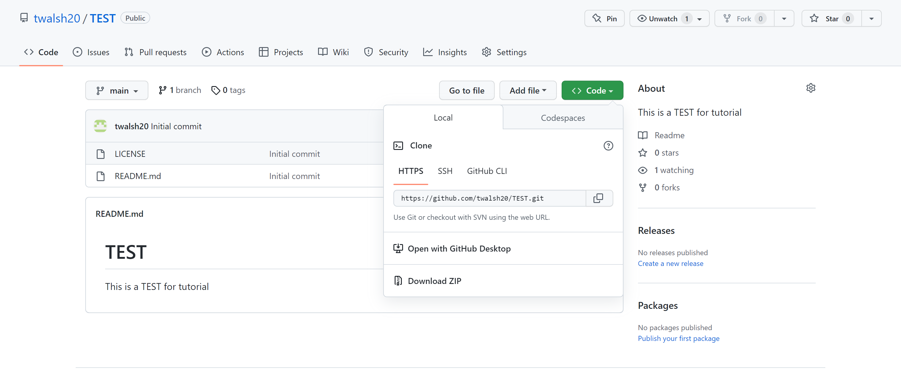

# Hello and welcome to the best github tutorial!
## Thanks for being here!!
### After reading this, you will be off coding like a coyote in no time.

#### Let's begin!

* First, before we can even dream of making a web page, we need to create a Github account. Click this link: [Github Website Login](https://github.com) and throw in a fun username and password and you'll be on your way.
* To build a web page, you'll also need R Studio and R, which you can download with this link: [RStudio and R Download](https://posit.co/download/rstudio-desktop/). You'll have to install and run the programs.
* Great stuff so far. I am very proud of you! 
* We got some tough steps coming up so be prepared!
* In order to link R Studio and Github, you'll also have to download git from this link: [git Download](https://git-scm.com/downloads). If you have a windows computer like I do, you'll have no problem, but if you have a Mac, I reccomend either getting a new computer or downloading Xcode to allow git to work properly.
* Once that's all taken care of we are so close to creating our own webpage!
* To create a web page, we first need Github and R Studio to communicate, which is why we downloaded git.
* In Github, you'll need to create a new repository in your profile.
* There should be a green *create* or *new* button under the repository menu that will allow you to create a repository.
* Give it a nice little name, check the box to add a  README file, and add a license (MIT is a good license to use).
  
 * Once you create your repository, you need to click the green code button on the right side of the screen and copy the link that is given under that tab.
 
 * You also need your personal access token from Github to link R Studio and Github. This is found in your account settings, by clicking your profile picture and clicking settings. Scroll down to *Developer Settings* and click on *Personal access tokens* and then *Tokens*.
 * Every computer is different, but you will be prompted at some point to either login to git, or paste in your personal access token. You may also have to type in a command to the console panel of R Studio to prompt the linking of Github and R Studio, but admittedly I forget the command.
 * Once this is done, you'll need to click the *Project (None)*  button in R Studio, it should be in the top left of one of the panels. 
 * Click *New Project*, then *Version Control* and then choose the git option. It will prompt you with naming and adding a URL for your project. This is where you should paste the link we took from the code menu of our Github repository. 
 * We are so so close to our own web page!!!!
 * After pasting the URL, you should have a new project that has the files from your Github repository and a few extra files as well. 
 * You then should find the little white page icon with a green plus sign in the top left of R Studio and open the drop down menu and click *R Markdown*
 * You can name this file anything in the naming box R Studio prompts you with, but you **must** save it onto your computer as just *index*.
 * This file will be your web page!!
 * You must knit the file to html using the knit button in order to create an index.html file that will allow your web page to exist.
 * You can delete all the junk writing underneath the heading section that includes the author, date, output, and title in the index.Rmd file.
 * You can write anything you want, create differing sized headers with varying amounts of hash tags, create tables with dashes and lines, add links and images and a whole bunch of things.
 * We are almost done!
 * Once you have played around with your index.Rmd, in the terminal tab of one of your panels, you will need to type some commands to save and send the changes you made to your repository.
 * *git status* is the first command you should type into the terminal and run. This will let you know what changes you have to your repository file that have not been saved. *git add -A* is a command that will add the changes and allow us to save them. *git commit -am <'with a message'>* is a command that saves the changes we made. Finally, once our changes our saved or committed, we can use *git push* to send these changes to our Github repository. We can use *git status* throughout this process to determine the status of our changes and if they have been pushed and committed, but we should follow the order of commands in this bullet point to properly add, commit and push our changes. 
 * Finally, once we are sure all of our changes are saved and in our repository, we can head back to our Github repository. We can head to the settings section of the repository, not of your profile, and scroll to the pages tab which should be on the left side.
 * Once in the pages tab, you should find the *Branch* header and select *main branch* from the drop down menu. After okaying this change, your page should update with a message that your website is live and that you can visit it!!
 
* I hope this helped!!

* Thanks for reading!
